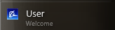
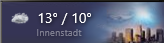
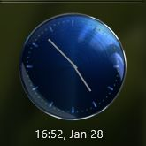

Longhorn Sidebar for Rainmeter
=======================

---------------
Can't believe nobody made a proper Longhorn Sidebar for Rainmeter.
So here it is!
A modernized, yet nostalgic Sidebar with lots of great features and skins...

# FEATURES IN 2.1:

## Parts / Widgets
You'll find almost every Part you may want:

Preview|Name|Features|Alternatives
|-|-|-|-|
||**Template**|Development Template to easily create a new Part|Yes
||**User**|Shows Username and Icon, configurable Text|No
||**Search**|Lets you Search Google, opens browser with query|No
||**MediaPlayer**|Works with most Media Players, Configurable|Yes
||**Weather**|Configurable Weather, shows lots of info in Tooltip|Yes
||**RSS**|Shows XML RSS Feeds|Yes
||**Favorites**|Configurable App / Website Launcher|Yes
||**Greeter**|Changes depending time of the day, Configurable|No
||**Launcher**|5 App Launcher, Configurable|No
||**Network**|Shows Network Activity in a graph|No
||**CPU**|Shows CPU Activity|No
||**RAM**|Shows RAM Usage and Activity|No
||**Storage**|Shows selected Disk Usage|Yes
||**Visualizer**|Animates to Music|Yes
||**Recycle Bin**|Shows Recycle Bin size|Yes
||**Shortcuts**|Configurable 4 website launcher|No
||**Notes**|Simple Notes editor|Yes
||**Slideshow**|Configurable Slideshow, Shows and Opens Pictures|Yes
||**ToDo**|Interactive ToDo Tile, Remembers Marked items as complete|Yes
||**Uptime**|Shows PC Uptime, Right click lets you Shutdown, Sleep, etc|No
||**WorldClock**|Shows World Time, Configurable|Yes
||**Clock**|Shows the time...|Yes
||**Clock2**|Shows the time... in another style|Yes
||**Clock3**|Shows the time... in yet another style|Yes
||**MediaPlayerAlternative**|Same as Music Player|Yes

----

## Skins / Styles
Included Skins from the Classics:

The Sidebar is also colorizable through the Settings Window.

## Capabilities
- High DPI included for 100%, 150% and 200% Displays
- Ability to position on the Right or on the Left with one click
- Option to stay on top of other Windows (Reserve screen space)
- Auto-layout on screen resolution change (new)
- Easy Snapping
- Blur Effect on Win10 / Win11
- Super easy Customization
- Lots of Variants in every Widget
- Big Clock Calendar
- Possible future Translations
- Create your own Part using included Parts\Template

## Extras
Some more included Extras for real Longhorn fans:

Preview|Name|Features
|-|-|-|
||**Reserve Screen Space**|Included Utility lets you realistically reserve screen space for the Sidebar, does not run in Memory
||**Tray Clock**|Clicking the lower Clock opens up the Classic Longhorn Calendar
||**Search**|Included the Animated Logo from the Longhorn Demo, you can put it anywhere on your Desktop or the Sidebar
||**Build Tag**|Put a configurable Build tag on your Desktop
||**Search**|The sidebar has lots of configuration options

BUGS & TRANSLATIONS
----
If you find any bugs just let me know in a comment or something.
Technically this thing supports multiple languages, you need to edit English.inc and replace it with your values.
I started a few languages already but then I got lazy.

LICENSE
-------
Software and Components

Images and Media 

CREDITS
------
Thank you to MrLapinou for Longhorn Research
Credits to guinness for coming up with the reserve screen space AutoIt Script
